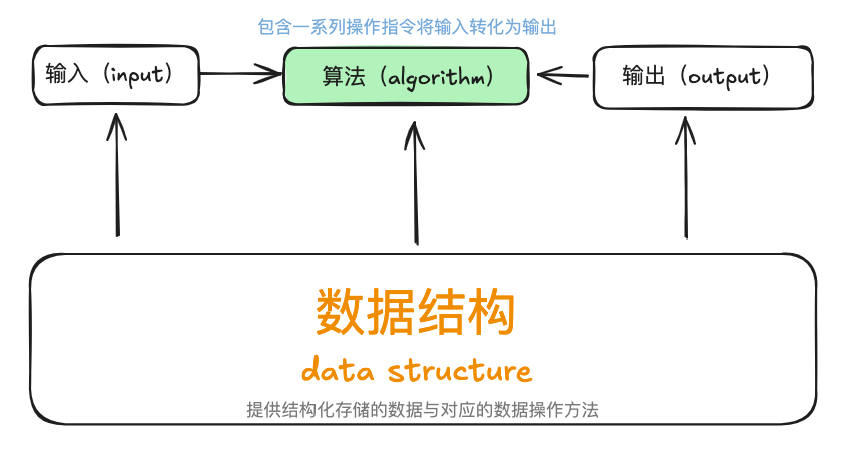
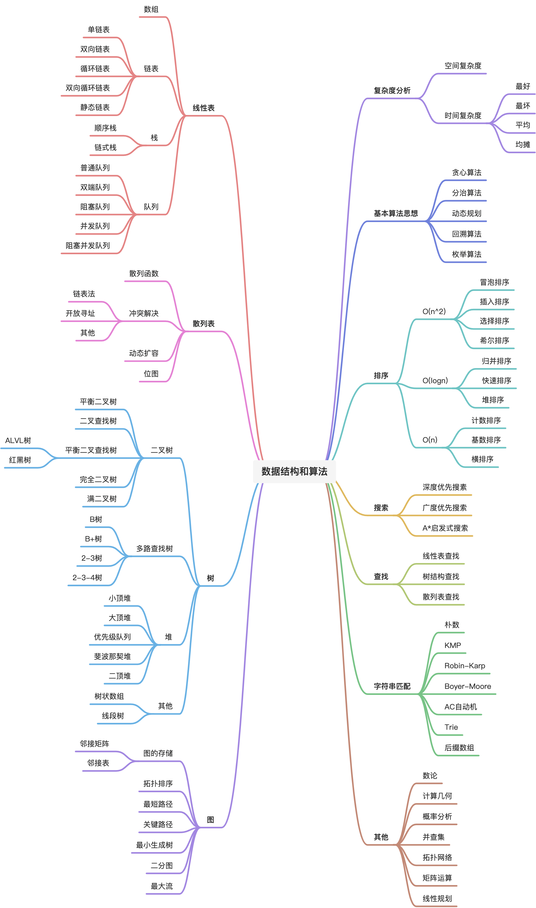

:::tip 一言
基础知识就像是一座大楼的地基，它决定了我们的技术高度。而要想快速做出点事情，前提条件一定是基础能力过硬，“内功”要到位。
:::

## 一、数据结构与算法是什么？

### 算法

算法（algorithm）是在有限时间内解决特定问题的一组指令或操作步骤，有以下特点：

- 问题是明确的，包含清晰的输入和输出定义。
- 具有可行性，能够在有限步骤、时间、和内存空间下完成。
- 各步骤都有确定的含义，在相同的输入和运行条件下，输出始终相同。

### 数据结构

数据结构（data structure）是组织和存储数据的方式，涵盖数据内容、数据之间关系和数据操作方法，具有一下设计目标：

- 空间占用尽量少，以节省计算机内存。
- 数据操作尽可能快，涵盖数据访问、添加、删除、更新等。
- 提供简介的数据表示和逻辑信息，以便算法高效运行。

总结：数据结构是指一组数据的存储结构，算法就是操作数据的方法，数据结构和算法解决的是如何更省、更快的存储和处理数据的问题。
## 二、对数据结构与算法的理解

1. 对于任何数据结构，其基本操作无非遍历+访问，具体点就是增删改查；

2. 数据结构种类很多，其存在的目的就是在不同的应用场景中，尽可能高效地增删改查，这也是数据结构的使命；

3. 数据结构和算法是相辅相成的，数据结构是为算法服务的，而算法要作用在特定的数据上。

4. 数据结构设计是一个充满权衡的过程，如果想在某方面取得提升，往往需要在另一方面作出妥协。如：

   - 链表相较于数组，在数据添加和删除操作上更加便捷，但牺牲了数据访问的速度。
   - 图相较于链表，提供了更丰富的逻辑信息，但需要占用更大的内存空间。

   

## 常用数据结构与算法的总览

