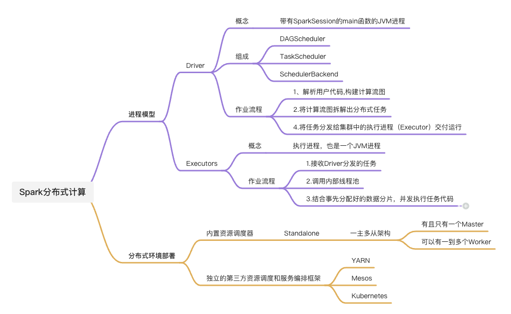
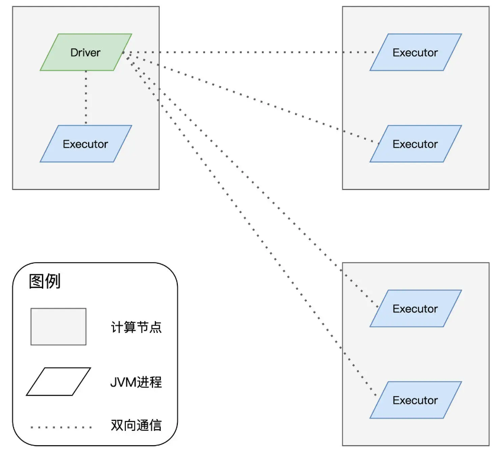

## 内容预览

## 分布式计算的核心

- 分布式计算的精髓，在于如何在抽象的计算流图，转化成实实在在的分布式计算任务，然后以并行计算的方式交付执行。
- 实现分布式计算的两个关键要素：
  - 进程模型
  - 分布式的环境部署

## 进程模型

### 概念：

- 在spark的应用开发中国，任何一个应用程序的入口，都是带有SparkSession的main函数
- SparkSession在提供Spark运行时上下文的同时（如调度系统、存储系统、内存管理、RPC通讯），也可以为开发者提供创建、转换、计算分布式数据集（RDD）的开发API

### 进程模型的组成

#### Driver

- 本质上是一个JVM进程，在分布式计算环境中，有且只有一个这样的进程
- 核心组件——>组成任务调度器
  - DAGScheduler
  - TaskScheduler
  - SchedulerBackend
- 核心流程：
  1. 解析用户代码构建计算流图
  2. 根据计算流图拆解出分布式任务
  3. 将分布式任务分发到Executors中执行

#### Executors

- 任务的执行者，也是一个JVM进程，可以有多个
- 核心流程：
  1. 接收到任务后，调用内部线程池
  2. 结合事先分配好的数据分片，并发地执行任务代码

#### Driver和Executors的进行过程

## 分布式部署

### 部署方式

- Standalone --->内置资源调度器
- 第三方资源调度与服务编排框架
  - YARN
  - Mesos
  - Kubernetes

### 部署流程

TODO后续补充
