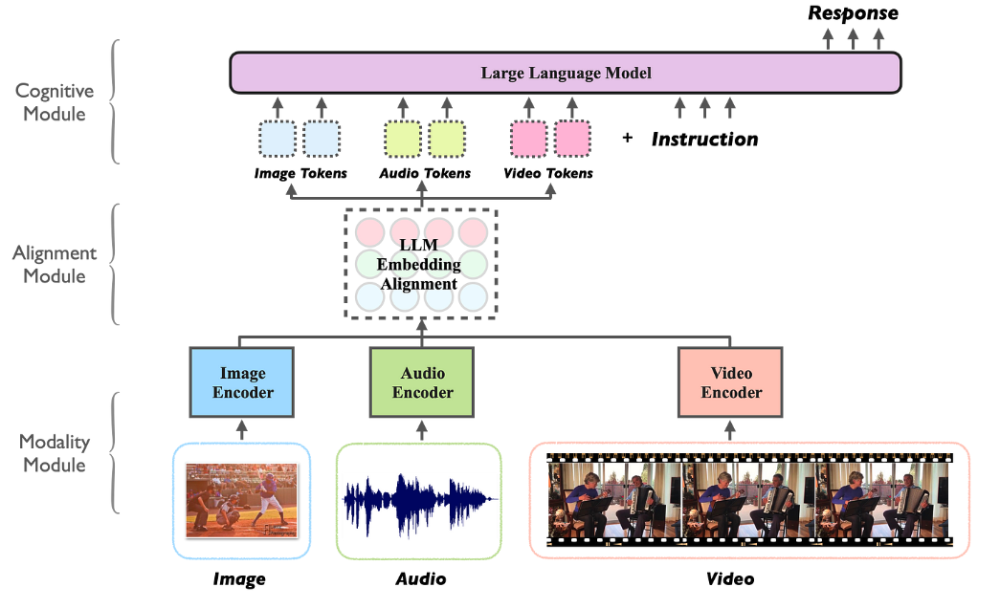

## 20250416: 什么是多模态模型

> 2025-04-16 23:14:36

**多模态模型（Mutlimodel LLM）是能够同时处理和关联多种数据模态（如：文本、图像、视频等）的大语言模型。这类模型通过统一表示空间，实现跨模态的语义理解和内容生成。**

- 核心工作原理（多模态模型的工作机制包含三个关键阶段）：

  - **模态编码**：使用专用编码器（CNN/ViT 处理图像、BERT 处理文本等）提取各模态特征
  - **特征对齐**：通过交叉注意力机制（cross-attention）建立细粒度跨模态关联（如图像区域与文本描述的对应关系）
  - **联合推理**：在共享**表示空间**中进行跨模态信息融合与语义推理

- 技术优势（系统实现角度）

  - 统一接口：支持自然语言作为跨模态交互的统一接口
  - 知识迁移：视觉-语言等跨模态知识的相互增强
  - 上下文扩展：能同时利用多模态上下文信息（如文本描述+示意图）
  - 数据效率：通过多任务学习提升小样本场景表现
  - 灵活部署：架构灵活性，支持级联式（冻结编码器+可训练适配器）或端到端联合训练架构（不同模态流程整合到单一神经网络中的架构）

- 实现挑战（工程化角度）

  - 计算复杂度：多模态并行处理带来的显存/算力压力
  - 对齐噪声：跨模态数据标注的噪声会影响注意力机制
  - 模态鸿沟：不同模态特征分布的差异导致融合困难
  - 延迟积累：级联架构中各组件（如图像编码器+LLM）的推理延迟叠加问题
  - 评估困境：现有基准（如 MMLU、MMBENCH）难以全面评估跨模态推理能力

---

## 20250415: 什么是大模型量化

> 2025-04-15 01:43:53

量化（Quantization）是一种通过降低模型参数的数值精度来压缩模型大小的技术。在深度学习中，模型的参数通过以32位浮点数（FP32）来存储，通过量化可以将其转换成更低精度的表示形式，从而减少模型的内存占用和计算开销。

FP32的大小是4字节（每个字节8bit, 4字节* 8bit =32 bit）而 FP16的大小是2字节，则为16bit.

这也是为什么大家喜欢用 Q4量化模型的原因，跟 FP16（16bit）的模型相比，Q4（4bit）的模型只有1/4的大小，运行起来需要的内存也是1/4.

现在大多数模型训练都采用 FP16的精度，而当下流行的Deepseek-V3采用了 FP8精度训练，能显著提升训练速度和降低硬件成本。

- Q4_K_M 是什么意思

  - 这种命名方式一般是 GGUF&GGML 格式的模型，它们通常采用 K量化模型，格式类似 Q4_K_M，这里的 Q 的后面数字代表量化精度，K代表 K量化方法，M代表名在尺寸和 PPL(Perplexity,困惑度)之间的平衡度，有0, 1，XS, S, M, L 等
  - PPL 是评估语言模型性能的重要指标，它用来衡量模型对下一个词的预测准确程度。常见 Kl量化版本的 PPL 对比（这是一个7B 模型）

  -  

- bf16、4bit、int4、fp8是什么意思
  - bf16是16bit 的精度，4bit 是4bit 精度，同样也建议至少使用4bit 量化的模型，除非模型特别大200B+

---

## 20250414: 什么是 LLM蒸馏技术

> 2025-04-14 00:25:15

LLM 蒸馏（Distillation）是一种技术，用于将大语言模型(LLM)的知识转移到较小的模型中。其主要目的是在保持模型性能的同时，减少模型的大小和计算资源需求。通过蒸馏技术，较小的模型可以在推理时更高效地运行，适用于资源受限的环境。

- 蒸馏过程（步骤）

  - 训练教师模型：首先训练一个大型且性能优越的教师模型。

  - 生成软标签：使用教师模型对训练数据进行预测，生成软目标（soft targets），这些目标包含了教师模型的概率分布信息。

  - 训练学生模型：使用软目标和原始训练数据（hard targets）来训练较小的学生模型，使其能够模仿教师模型的行为。这种方法不仅可以提高模型的效率，还可以在某些情况下提高模型的泛化能力。

- 蒸馏的优点

  - 减少模型大小和计算资源需求

  - 增加推理速度、易于访问和部署

- 蒸馏可能存在的问题

  - 信息丢失：由于学生模型比教师模型小，可能无法完全捕捉教师模型的所有知识和细节，导致信息丢失。

  - 依赖教师模型：学生模型的性能高度依赖于教师模型的质量，如果教师模型本身存在偏差或错误，学生模型可能会继承这些问题。

  - 适用性限制：蒸馏技术可能不适用于所有类型的模型或任务，尤其是那些需要高精度和复杂推理的任务。

- 典型例子

  - GPT-4o(教师模型)中提炼出 GPT-4o-minio(学生模型)

  - Deepseek-R1(教师模型)中提炼出 Deepseek-R1-Distill-Qwen-32B(学生模型)：这个不是传统意义上的蒸馏，是蒸馏+数据增强+微调

- 其他蒸馏技术

  - 数据增强：使用教师模型生成额外的训练数据。通过创建更大、更具包容性的数据集，学生模型可以接触到更广泛的场景和示例，从而提高其泛化性能。

  - 中间层蒸馏：将知识从教师模型的中间层转移到学生模型。通过学习这些中间表示，学生模型可以捕获更详细和结构化的信息，从而获得更好的整体表现。

  - 多教师蒸馏：通过汇总不同教师模型的知识，学生模型可以实现更全面的理解并提高稳健性，因为它整合了不同的观点和见解。

